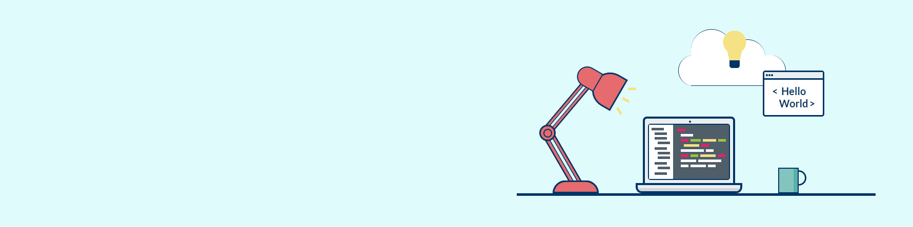

### Hi, I'm Agata 👋

I became interested in web development a few years ago, and every new skill makes my passion for it grow. But there was always something in the way of me committing to it fully... at least until the pandemic hit. After a few weeks of anxiously waiting for it to go away (oh, sweet summer child), I thought I'd better make use of all this 'extra' time. I explored a few areas of web development, until I really sank deep into ✨ frontend ✨. And now I never want to go back! 😄

## In short

- 🙂 Pronouns: she/her
- 💬 I love books. Ask me about the book I'm reading!
- 📫 You can reach me on [Twitter](https://twitter.com/AgataLiberska) or via email <liberska@gmail.com>
- ⚡ Fun fact: in my free time, I talk about English and life in the UK on [Instagram](https://www.instagram.com/naturalnie_po_angielsku/)
- 👯 I'm a big fan of [Frontend Mentor](https://frontendmentor.io). Love both working on their challenges and giving feedback to others.

## 🛠 Tools and technologies 

## Currently learning

<!--Here are some ideas to get you started:

- 🔭 I’m currently working on ...
- 🌱 I’m currently learning ...
- 👯 I’m looking to collaborate on ...
- 🤔 I’m looking for help with ...
- 💬 Ask me about ...
- 📫 How to reach me: ...
- 😄 Pronouns: ...
- ⚡ Fun fact: ...
-->

